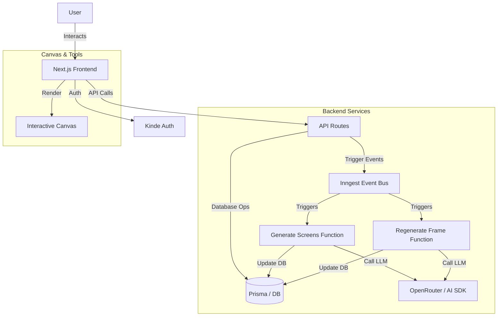
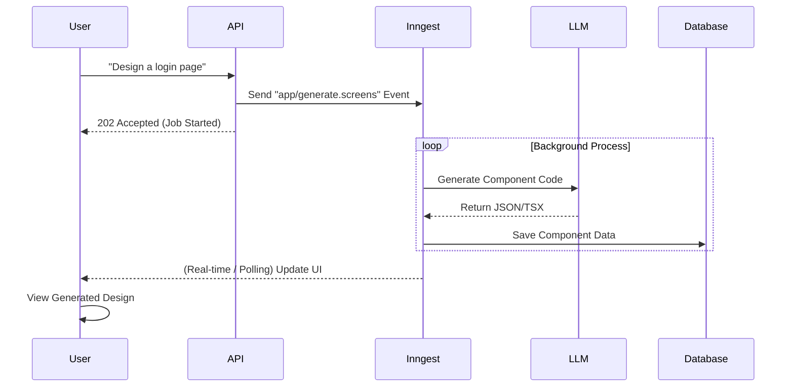

# DesignGPT (xdesign-ai)


**DesignGPT** is a powerful, AI-driven design generation platform that empowers users to create and iterate on user interface designs effortlessly. By leveraging advanced LLMs and background processing workflows, DesignGPT transforms text prompts into editable, high-fidelity UI components.

## 📸 Previews

<div align="center">
  
  
</div>

---

## 🚀 Key Features

| Feature                      | Description                                                                                                    |
| :--------------------------- | :------------------------------------------------------------------------------------------------------------- |
| **🤖 AI Design Generation**  | Generate comprehensive UI designs from simple text prompts using state-of-the-art LLMs.                        |
| **🎨 Interactive Canvas**    | A fully zoomable and pannable canvas (powered by `react-zoom-pan-pinch` and `react-rnd`) for detailed editing. |
| **🔄 Background Workflows**  | Robust job processing with **Inngest** for reliable, long-running generation tasks without blocking the UI.    |
| **⚡ Real-time Updates**     | Seamless usage with optimistic UI updates and real-time feedback loops.                                        |
| **🔐 Secure Authentication** | Enterprise-grade authentication integrated via **Kinde Auth**.                                                 |
| **📱 Responsive Features**   | Optimized for various screen sizes with a mobile-first approach.                                               |
| **📸 Screenshot & Export**   | Built-in capabilities to capture and export your designs using Puppeteer.                                      |

---

## 🛠️ Architecture

DesignGPT is built on a modern event-driven architecture. The frontend communicates with the backend via API routes, which trigger asynchronous jobs in Inngest for heavy lifting (AI generation), keeping the user experience snappy.



### Inngest Workflows



---

## 🧰 Tech Stack

### Core

- **Framework:** [Next.js 16](https://nextjs.org/) (React 19)
- **Language:** [TypeScript](https://www.typescriptlang.org/)
- **Styling:** [Tailwind CSS 4](https://tailwindcss.com/)
- **Components:** [Radix UI](https://www.radix-ui.com/), [Lucide React](https://lucide.dev/)

### Backend & Data

- **Database ORM:** [Prisma](https://www.prisma.io/)
- **Auth:** [Kinde](https://kinde.com/)
- **Background Jobs:** [Inngest](https://www.inngest.com/)
- **API Handling:** [Axios](https://axios-http.com/), [Tanstack Query](https://tanstack.com/query/latest)

### AI & Automation

- **AI SDK:** [Vercel AI SDK](https://sdk.vercel.ai/docs)
- **LLM Provider:** OpenRouter
- **Headless Browser:** Puppeteer Core / Sparticuz Chromium

---

## 🏁 Getting Started

### Prerequisites

- Node.js 18+
- npm or pnpm
- PostgreSQL Database (or a hosted provider like Neon/Supabase)

### Installation

1. **Clone the repository**

   ```bash
   git clone https://github.com/yourusername/xdesign-ai.git
   cd xdesign-ai
   ```

2. **Install dependencies**

   ```bash
   npm install
   ```

3. **Environment Setup**
   Create a `.env` file in the root directory based on `.env.example`:

   ```env
   DATABASE_URL="postgresql://..."
   KINDE_CLIENT_ID="..."
   KINDE_CLIENT_SECRET="..."
   KINDE_ISSUER_URL="..."
   KINDE_SITE_URL="http://localhost:3000"
   KINDE_POST_LOGOUT_REDIRECT_URL="http://localhost:3000"
   KINDE_POST_LOGIN_REDIRECT_URL="http://localhost:3000/dashboard"
   OPENROUTER_API_KEY="..."
   INNGEST_EVENT_KEY="..."
   INNGEST_SIGNING_KEY="..."
   ```

4. **Initialize Database**

   ```bash
   npx prisma generate
   npx prisma db push
   ```

5. **Run the Development Server**
   You need to run both the Next.js dev server and the Inngest dev server.

   ```bash
   # Terminal 1: Next.js
   npm run dev

   # Terminal 2: Inngest
   npx inngest-cli@latest dev
   ```

6. **Open the App**
   Visit [http://localhost:3000](http://localhost:3000).
   The Inngest dashboard is available at [http://localhost:8288](http://localhost:8288).

---

## 📂 Project Structure

```bash
📦 DesignGPT
├── 📂 app                 # Next.js App Router (Routes, Layouts, API)
│   ├── 📂 (routes)        # Application routes
│   └── 📂 api             # API Endpoints (Inngest, Screenshot, Project)
├── 📂 components          # Reusable UI Components
├── 📂 inngest             # Inngest Functions & Config
│   └── 📂 functions       # Background job definitions (generateScreens, etc.)
├── 📂 lib                 # Utility libraries (DB, Utils)
├── 📂 prisma              # Database Schema & Migrations
├── 📂 public              # Static assets and images
└── 📄 package.json        # Dependencies and Scripts
```

---

## 🤝 Contributing

Contributions are welcome! Please follow these steps:

1. Fork the project.
2. Create your feature branch (`git checkout -b feature/AmazingFeature`).
3. Commit your changes (`git commit -m 'Add some AmazingFeature'`).
4. Push to the branch (`git push origin feature/AmazingFeature`).
5. Open a Pull Request.

## 📄 License

Distributed under the MIT License. See `LICENSE` for more information.

**Author:** Mausam Kar
